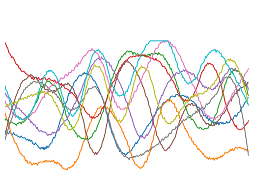
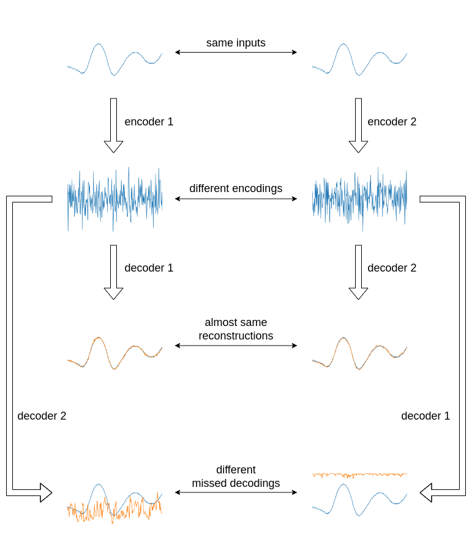
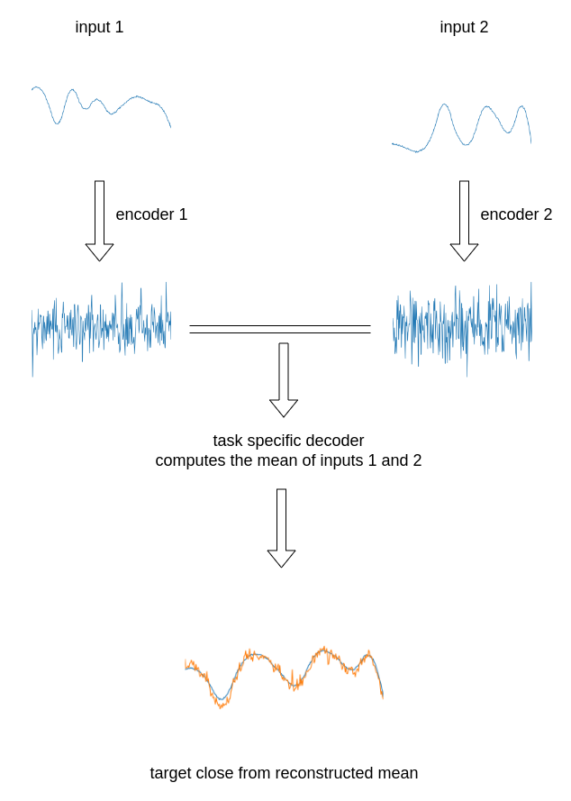

&nbsp;
&nbsp;

<div align="center">
  
</div>

<div align="center">

**Deep Secure Transform**

</div>

<div align="center">

[](https://pytorch.org/)
[](https://opensource.org/licenses/MIT)

</div>

## Introduction
**Deep Secure Transform** takes its main idea from [DeepEdn](https://arxiv.org/abs/2004.05523). It allows data to be encrypted using a neural network autoencoder, in such a way that computation remains possible on encrypted data, by means of other neural networks. This approach makes it possible to envisage privacy preserving collaborative computation, e.g. for supply chain optimization, in a simple and efficient way.

## Setup
1. Clone the Deepsecuretransform repository.

    ```console
    git clone https://github.com/louisLT/deepsecuretransform.git
    ```

2. Set environment variable $DUMPS_DIR, with directory where experiment results will be stored.

3. Construct virtual environment in [Anaconda](https://www.anaconda.com/):

    ```console
    conda env create -f environment.yml
    ```

4. Train and test two different autoencoders:

    ```console
    python main.py --train_autoencoder
    python main.py --train_autoencoder
    ```
Two folders *version_001* and *version_002* will be created in your dump directory, with results, logs, figures and model checkpoints.

5. Train and test a task-specific decoder making the sum of two time series respectively encoded by autoencoders 1 and 2.

    ```console
    python main.py --train_sum_decoder --encoder_version_numbers 1 2
    ```
Here we could set any number of version numbers (provided they correspond to dump folders created during autoencoder trainings), to sum more than two time series.

## Time series generation

The time series generator permits to create random realistic time series of 256 data points ranging between 0 and 1. These generated time series are used for both training and test. Below are a few examples.

<div align="center">

</div>

## Private autoencoder

The autoencoder is composed of an encoder and a decoder module.

The encoder module is a succession of 1D convolutional layers, followed by a fully connected layer, outputing a 256 length feature vector in the latent space. This feature vector is the encoded time series.

The decoder module ic composed of a fully connected layer, followed by a succession of 1D deconvolutional layers, outputing a time series of the same format as the input.

Each training gives different encoders and decoders, due to the random initialization of weights and the randomness in data distribution. For this reason, if two data owners 1 and 2 operate two trainings independantly, the decoder 2 cannot be used to retrieve data encoded with decoder 1. The decoder networks must be kept secret by data owners, and considered as decryption keys.

An illustration of the process is given below.

<div align="center">

</div>

## Task specific decoder

Encoded data are trained as such manner that no information is lost, and that it is possible to retrieve original data with a neural network. For this reason, it is possible to train a task-specific decoder, taking several inputs encoded with different models, and outputing the result of a computation on these inputs. As any function can be simulated by a neural network, this method theoretically permits to calculate anything on some data split between several data owners, while ensuring each of them that nothing else can be done from these data.

In our example, we just train a neural network to compute the mean of two time series.

An illustration of the process is given below.

<div align="center">

</div>
